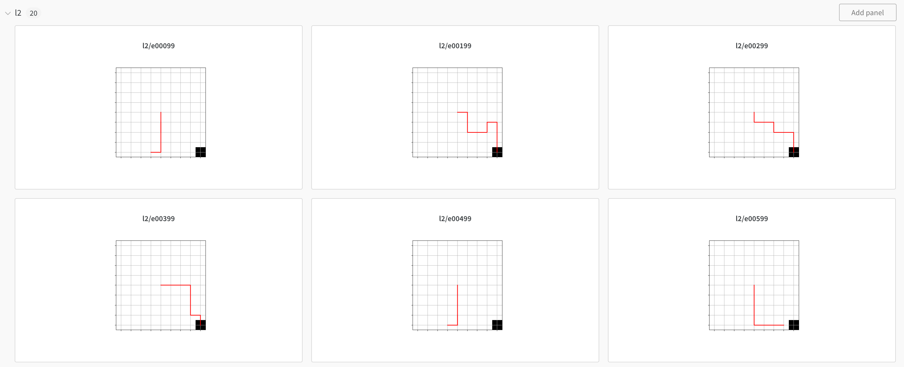

This is an **unofficial** implementation of the paper "In-context Reinforcement Learning with Algorithm Distillation" ([paper](https://arxiv.org/abs/2210.14215)).
Only the DarkRoom environment is implemented in this repository.

## Installation

```
pip install -r requirements.txt
```
Then set up wandb by running `wandb login` in the terminal.

## Run Experiments

First generate learning trajectories using a source RL algorithm (A2C).
```
python generate_lifetimes.py --env_id DarkRoom-v0
```
By default, generated trajectories are saved as `darkroom_normal_*.pkl`.

Then, train the Transformer model.
```
python in_context_learner.py --env_id DarkRoom-v0
```
By default, the trained model is saved in `output`.

Finally, test the Transformer model by rolling out the policy.
```
python in_context_learner.py --env_id DarkRoom-v0 --eval
```

An example of the finally generated trajectories by the Transformer model:



## Note

So far I haven't reproduced the results in the paper. It appears that I still need to search the hyperparameters, and the temperature in Transformer decoding is also a key factor -- greedy decoding does not seem to work as it generates deterministic policies without exploring the domain.